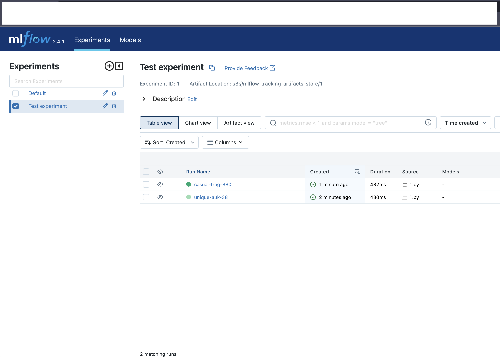

# Mlflow tracking UI
Deployes MLFLOW tracking UI to AWS cloud. Dependecies:
- AWS App Runner to host tracking UI
- AWS RDS Postgre as mflow persistant layer
- AWS S3 as storage for storing runs artifacts

